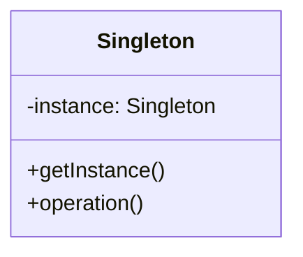
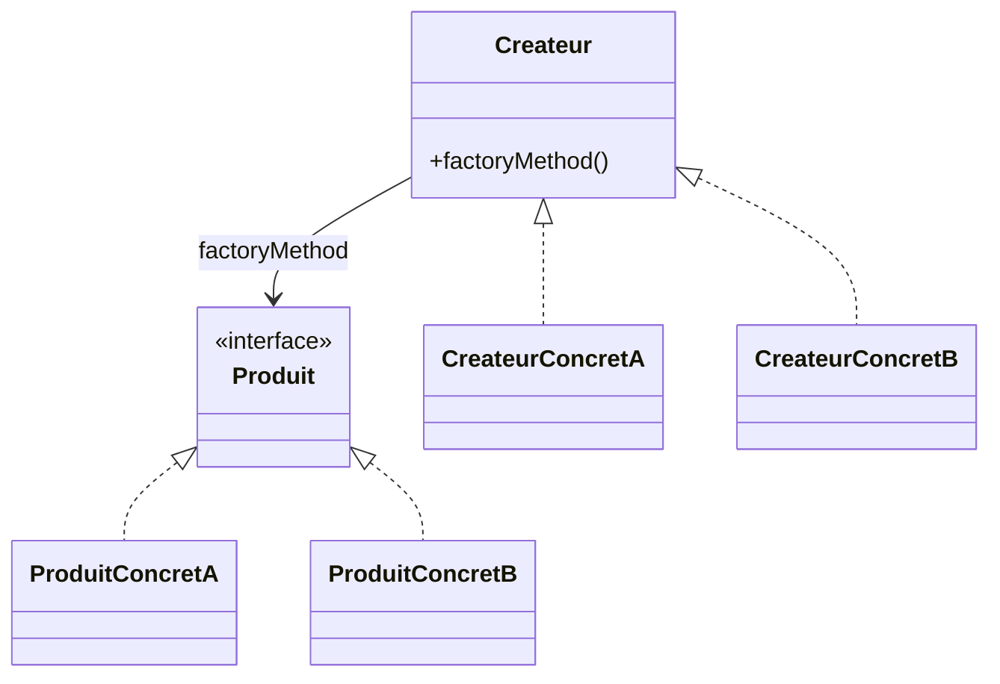
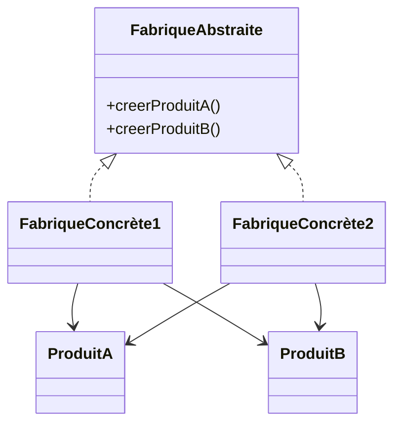
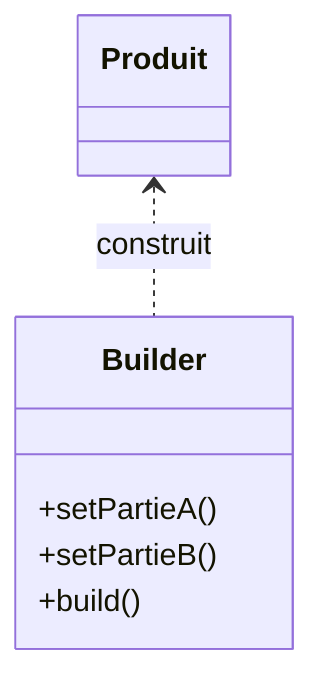
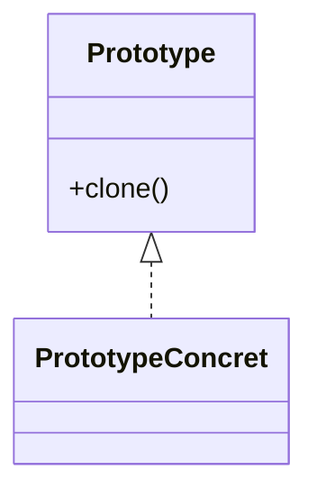

# Creational Design Patterns

Les patterns de création facilitent la création d'objets tout en cachant la logique de création. Ils permettent de rendre le code plus flexible, testable et indépendant des classes concrètes.

::: info
Utilisez ces patterns pour éviter le couplage fort entre les classes et la logique de création d'objets.
:::

## Singleton
Le Singleton garantit qu'une classe n'a qu'une seule instance et fournit un point d'accès global à cette instance.

**Diagramme de classe :**

**Explication :**
- `Singleton` possède une instance statique et une méthode d'accès globale. Le constructeur est privé pour empêcher la création d'autres instances.

**Quand l'utiliser ?**
- Quand une seule instance d'une classe doit exister (ex : gestionnaire de configuration, connexion à une base de données).

**Exemple Java**
```java
public class Database {
  // Instance statique unique de la classe Database
  private static Database instance;

  // Méthode publique statique pour obtenir l'instance unique de la classe
  public static synchronized Database getInstance() {
      if (instance == null) {
          instance = new Database();
      }
      return instance;
  }

  String lastData;

  // Constructeur privé pour empêcher la création de nouvelles instances
  private Database() {
      lastData = "Aucune donnée sauvegardée";
  }

  // Méthode pour écrire une donnée
  public void writeData(String data) {
      System.out.println("La dernière donnée sauvegardée est : " + lastData);
      // Code pour sauver la donnée (ici on se contente de la sauver dans la variable lastData)
      lastData = data;
      System.out.println("La nouvelle donnée sauvegardée est : " + lastData);
  }
}
```

::: warning
Le constructeur est privé pour empêcher la création d'autres instances.
:::

## Factory Method
Permet de déléguer la création d'objets à des sous-classes, sans connaître la classe exacte à instancier.

**Diagramme de classe :**

**Explication :**
- `Produit` est l'interface des objets créés.
- `Createur` déclare la factory method.
- Les sous-classes concrètes créent des produits spécifiques.

**Quand l'utiliser ?**
- Quand une classe ne sait pas à l'avance quel type d'objet créer.

**Exemple Java**
```java
// Produit abstrait
interface Animal {
    void parler();
}
// Produits concrets
class Chien implements Animal {
    public void parler() { System.out.println("Wouf!"); }
}
class Chat implements Animal {
    public void parler() { System.out.println("Miaou!"); }
}
// Créateur abstrait
abstract class AnimalFactory {
    public abstract Animal createAnimal();
}
// Créateurs concrets
class ChienFactory extends AnimalFactory {
    public Animal createAnimal() { return new Chien(); }
}
class ChatFactory extends AnimalFactory {
    public Animal createAnimal() { return new Chat(); }
}
// Utilisation
public class Main {
    public static void main(String[] args) {
        AnimalFactory factory = new ChienFactory();
        Animal animal = factory.createAnimal();
        animal.parler(); // Wouf!
    }
}
```

## Abstract Factory
Permet de créer des familles d'objets liés sans spécifier leurs classes concrètes.

**Diagramme de classe :**

**Explication :**
- `FabriqueAbstraite` définit les méthodes de création.
- Chaque fabrique concrète crée des variantes d'objets liés.

**Quand l'utiliser ?**
- Quand il faut garantir la cohérence entre objets d'une même famille (ex : widgets graphiques pour différents OS).

**Exemple Java**
```java
interface GUIFactory {
    Button createButton();
    Checkbox createCheckbox();
}
class WinFactory implements GUIFactory {
    public Button createButton() { return new WinButton(); }
    public Checkbox createCheckbox() { return new WinCheckbox(); }
}
class MacFactory implements GUIFactory {
    public Button createButton() { return new MacButton(); }
    public Checkbox createCheckbox() { return new MacCheckbox(); }
}
// ... Définir Button, Checkbox, WinButton, MacButton, etc.
```

## Builder
Permet de construire un objet complexe étape par étape.

**Diagramme de classe :**

**Explication :**
- `Builder` construit progressivement un objet complexe.
- `Produit` est l'objet final.

**Quand l'utiliser ?**
- Quand la création d'un objet nécessite de nombreuses étapes ou options.

**Exemple Java**
```java
class Pizza {
    private String pate;
    private String sauce;
    private String garniture;
    public static class Builder {
        private String pate;
        private String sauce;
        private String garniture;
        public Builder pate(String p) { pate = p; return this; }
        public Builder sauce(String s) { sauce = s; return this; }
        public Builder garniture(String g) { garniture = g; return this; }
        public Pizza build() {
            Pizza pizza = new Pizza();
            pizza.pate = pate;
            pizza.sauce = sauce;
            pizza.garniture = garniture;
            return pizza;
        }
    }
}
// Utilisation
Pizza pizza = new Pizza.Builder().pate("fine").sauce("tomate").garniture("fromage").build();
```

## Prototype
Permet de créer de nouveaux objets en copiant un prototype existant.

**Diagramme de classe :**

**Explication :**
- `Prototype` définit la méthode de clonage.
- Les sous-classes concrètes sont clonées pour créer de nouveaux objets.

**Quand l'utiliser ?**
- Quand la création d'un objet est coûteuse ou complexe, et qu'on peut partir d'un modèle existant.

**Exemple Java**
```java
class Sheep implements Cloneable {
    public Sheep clone() throws CloneNotSupportedException {
        return (Sheep) super.clone();
    }
}
Sheep s1 = new Sheep();
Sheep s2 = s1.clone();
```

::: info
Le pattern Prototype est utile pour dupliquer rapidement des objets configurés.
:::

Chaque pattern de création permet de résoudre des problèmes spécifiques liés à l'instanciation d'objets, tout en rendant le code plus flexible et maintenable.
