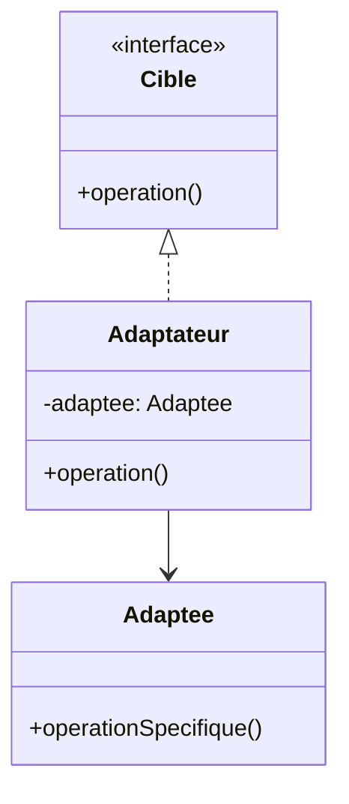
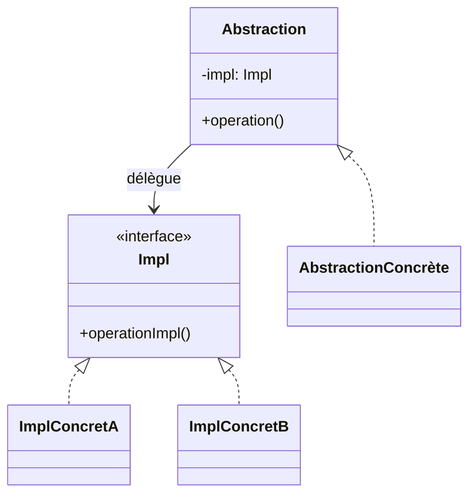
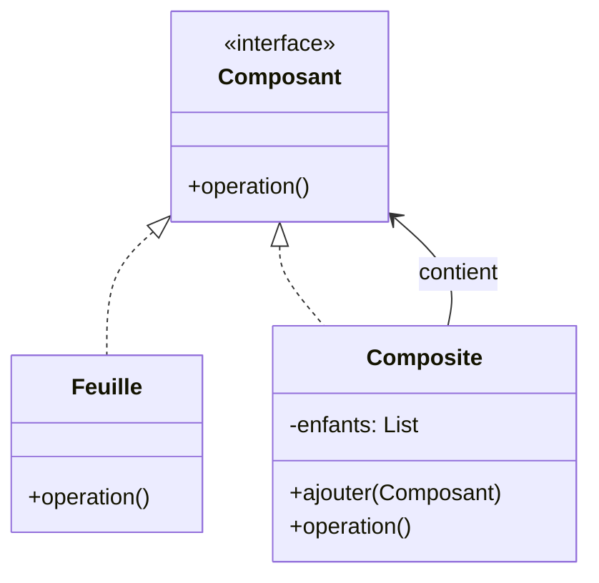
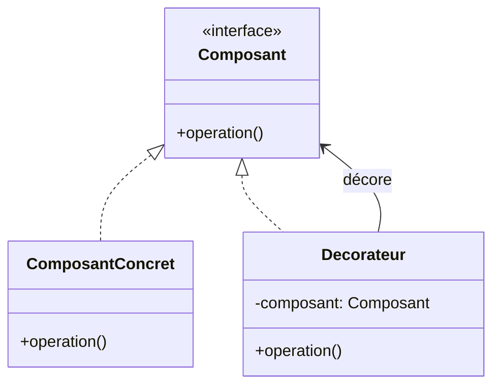
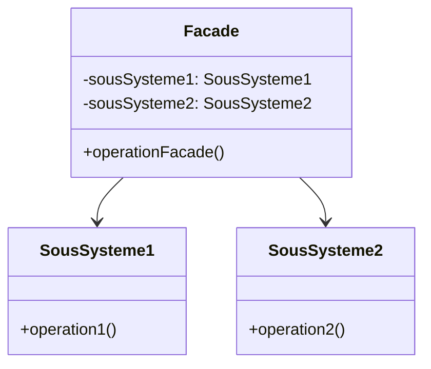
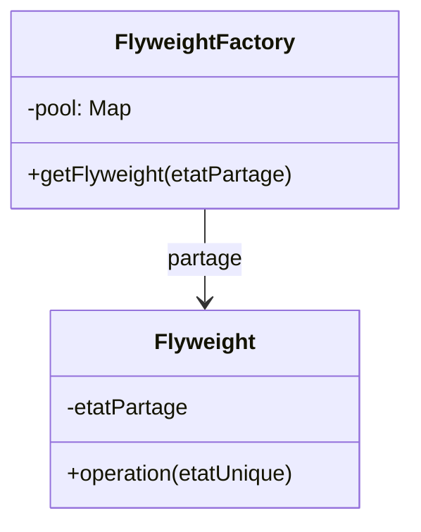
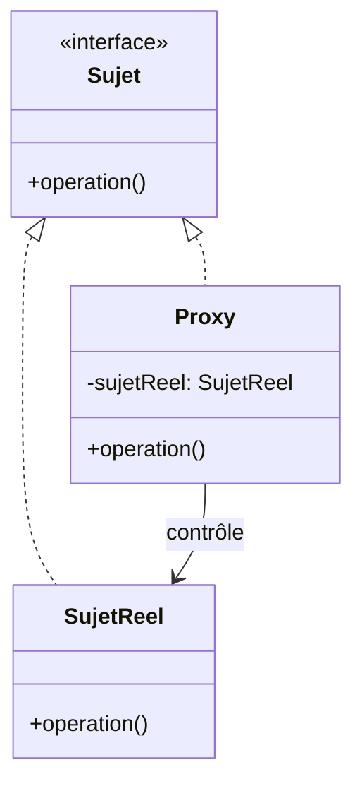

# Structural Design Patterns

Les patterns structurels facilitent la composition de classes et d'objets pour former des structures plus complexes. Ils permettent de rendre les architectures plus flexibles, évolutives et maintenables.

> **Info :**
> Utilisez ces patterns pour organiser et optimiser la structure de vos applications, sans modifier le code existant.

## Adapter
Permet de faire collaborer des classes qui n'ont pas d'interface compatible.

**Diagramme de classe :**

**Explication :**
- `Cible` définit l'interface attendue.
- `Adaptee` possède une interface existante.
- `Adaptateur` convertit l'interface de `Adaptee` en celle de `Cible`.

**Quand l'utiliser ?**
- Quand il faut intégrer une classe existante dans un nouveau système sans la modifier.

**Exemple Java**
```java
// Cible
interface Cible {
    void operation();
}
// Adaptee
class Adaptee {
    void operationSpecifique() { System.out.println("Spécifique!"); }
}
// Adaptateur
class Adaptateur implements Cible {
    private Adaptee adaptee;
    public Adaptateur(Adaptee a) { adaptee = a; }
    public void operation() { adaptee.operationSpecifique(); }
}
```

> **À retenir :**
> L'adaptateur agit comme un traducteur entre deux interfaces incompatibles.

## Bridge
Sépare l'abstraction de son implémentation pour qu'elles puissent évoluer indépendamment.

**Diagramme de classe :**

**Explication :**
- `Abstraction` utilise une implémentation (`Impl`).
- Les deux hiérarchies peuvent évoluer indépendamment.

**Quand l'utiliser ?**
- Quand il y a plusieurs variantes d'une abstraction et d'une implémentation.

**Exemple Java**
```java
interface DessinAPI { void dessinerCercle(int x, int y, int r); }
class DessinAPI1 implements DessinAPI {
    public void dessinerCercle(int x, int y, int r) {
        System.out.println("API1 Cercle");
    }
}
class Cercle {
    private int x, y, r;
    private DessinAPI api;
    public Cercle(int x, int y, int r, DessinAPI api) {
        this.x = x; this.y = y; this.r = r; this.api = api;
    }
    public void dessiner() { api.dessinerCercle(x, y, r); }
}
```

## Composite
Le pattern Composite permet de traiter de manière uniforme des objets simples et des compositions d'objets (arbres, hiérarchies, etc.).

**Diagramme de classe :**

**Explication :**
- `Composant` est l'interface commune.
- `Feuille` est un élément simple.
- `Composite` peut contenir plusieurs composants (feuilles ou composites).

**Quand l'utiliser ?**
- Quand il faut manipuler de façon identique des objets simples et des groupes d'objets.

**Exemple Java**
```java
interface Composant {
    void operation();
}
class Feuille implements Composant {
    public void operation() { System.out.println("Feuille"); }
}
class Composite implements Composant {
    private List<Composant> enfants = new ArrayList<>();
    public void ajouter(Composant c) { enfants.add(c); }
    public void operation() {
        for (Composant c : enfants) c.operation();
    }
}
```

> **Info :**
> Le composite est très utilisé pour les structures arborescentes (ex : menus, systèmes de fichiers).

## Decorator
Ajoute dynamiquement des responsabilités à un objet.

**Diagramme de classe :**

**Explication :**
- `Decorateur` ajoute des fonctionnalités à un composant sans modifier sa structure.

**Quand l'utiliser ?**
- Quand il faut ajouter des fonctionnalités à un objet sans modifier sa classe.

**Exemple Java**
```java
interface Boisson { String getDescription(); }
class Cafe implements Boisson {
    public String getDescription() { return "Café"; }
}
class DecorateurSucre implements Boisson {
    private Boisson b;
    public DecorateurSucre(Boisson b) { this.b = b; }
    public String getDescription() { return b.getDescription() + ", sucre"; }
}
```

## Facade
Fournit une interface unifiée à un ensemble d'interfaces dans un sous-système.

**Diagramme de classe :**

**Explication :**
- `Facade` simplifie l'accès à plusieurs sous-systèmes.

**Quand l'utiliser ?**
- Quand il faut simplifier l'utilisation d'un système complexe.

**Exemple Java**
```java
class Facade {
    private SousSysteme1 s1 = new SousSysteme1();
    private SousSysteme2 s2 = new SousSysteme2();
    public void operationFacade() {
        s1.operation1();
        s2.operation2();
    }
}
```

## Flyweight
Réduit la consommation mémoire en partageant des objets similaires.

**Diagramme de classe :**

**Explication :**
- `FlyweightFactory` gère le partage des objets `Flyweight`.
- `Flyweight` contient l'état partagé.

**Quand l'utiliser ?**
- Quand il y a un grand nombre d'objets similaires à instancier.

**Exemple Java**
```java
class Flyweight {
    private String etatPartage;
    public Flyweight(String etat) { this.etatPartage = etat; }
    public void operation(String etatUnique) {
        System.out.println(etatPartage + ", " + etatUnique);
    }
}
```

## Proxy
Fournit un substitut à un autre objet pour contrôler l'accès à celui-ci.

**Diagramme de classe :**

**Explication :**
- `Proxy` contrôle l'accès à `SujetReel` en implémentant la même interface.

**Quand l'utiliser ?**
- Pour contrôler l'accès, ajouter de la sécurité, du cache, ou du logging autour d'un objet.

**Exemple Java**
```java
interface Service {
    void operation();
}
class ServiceReel implements Service {
    public void operation() { System.out.println("Service réel"); }
}
class ProxyService implements Service {
    private ServiceReel service = new ServiceReel();
    public void operation() {
        System.out.println("Proxy : contrôle d'accès");
        service.operation();
    }
}
```

> **À retenir :**
> Les patterns structurels facilitent la maintenance et l'évolution des architectures logicielles.
