# Behavioral Design Patterns

Les patterns comportementaux facilitent la communication entre objets et la répartition des responsabilités. Ils permettent de rendre les interactions plus souples, découplées et évolutives.

> **Info :**
> Utilisez ces patterns pour organiser la logique métier et la communication entre objets sans créer de dépendances fortes.

## Observer
Le pattern Observer permet à un objet (le sujet) de notifier automatiquement ses observateurs lorsqu'un changement d'état survient. Cela permet de mettre en place des systèmes réactifs et découplés.

**Diagramme de classe :**
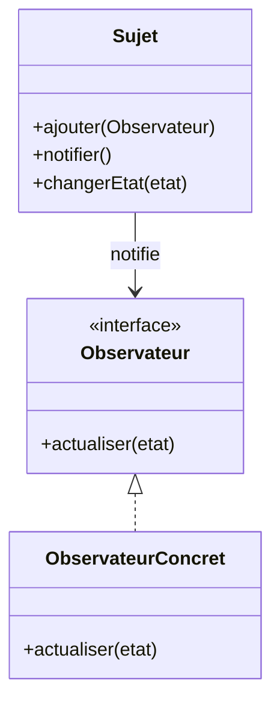
**Explication :**
- `Sujet` gère la liste des observateurs et notifie les changements.
- `Observateur` est une interface que doivent implémenter tous les observateurs.
- `ObservateurConcret` réagit aux notifications du sujet.

**Quand l'utiliser ?**
- Quand plusieurs objets doivent réagir à un changement d'état d'un autre objet (ex : interface graphique, notifications).

**Exemple Java**
```java
import java.util.*;
interface Observateur {
    void actualiser(String etat);
}
class Sujet {
    private List<Observateur> obs = new ArrayList<>();
    private String etat;
    public void ajouter(Observateur o) { obs.add(o); }
    public void notifier() {
        for (Observateur o : obs) o.actualiser(etat);
    }
    public void changerEtat(String e) {
        etat = e;
        notifier();
    }
}
class ObservateurConcret implements Observateur {
    public void actualiser(String etat) {
        System.out.println("Nouvel état : " + etat);
    }
}
// Utilisation
Sujet sujet = new Sujet();
Observateur o = new ObservateurConcret();
sujet.ajouter(o);
sujet.changerEtat("Nouveau!");
```

> **À retenir :**
> L'observateur permet de réagir automatiquement à des changements sans couplage fort.

## Strategy
Permet de changer dynamiquement l'algorithme utilisé par un objet.

**Diagramme de classe :**
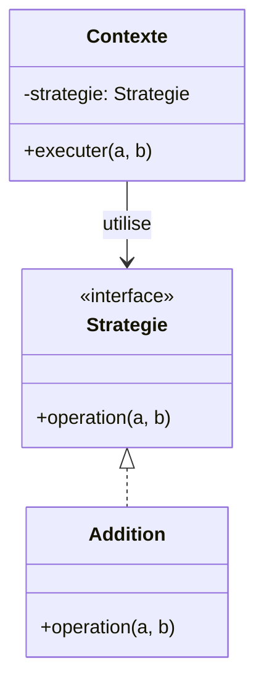
**Explication :**
- `Strategie` définit l'interface des algorithmes interchangeables.
- `Addition` est une implémentation concrète d'une stratégie.
- `Contexte` utilise une stratégie pour exécuter une opération.

**Quand l'utiliser ?**
- Quand plusieurs algorithmes sont interchangeables pour une même tâche.

**Exemple Java**
```java
interface Strategie {
    int operation(int a, int b);
}
class Addition implements Strategie {
    public int operation(int a, int b) { return a + b; }
}
class Contexte {
    private Strategie strategie;
    public Contexte(Strategie s) { strategie = s; }
    public int executer(int a, int b) { return strategie.operation(a, b); }
}
// Utilisation
Contexte c = new Contexte(new Addition());
System.out.println(c.executer(2, 3)); // 5
```

## Command
Encapsule une requête comme un objet, permettant de paramétrer des actions, les annuler, les mettre en file, etc.

**Diagramme de classe :**
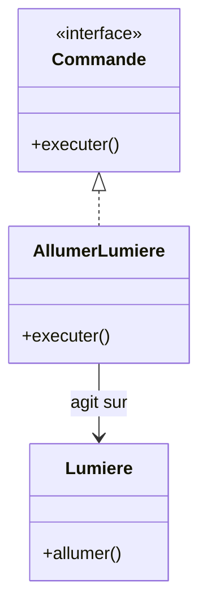
**Explication :**
- `Commande` définit l'interface des commandes.
- `AllumerLumiere` est une commande concrète qui agit sur `Lumiere`.
- `Lumiere` est le récepteur de la commande.

**Quand l'utiliser ?**
- Pour implémenter des actions annulables, des files de commandes, ou des menus dynamiques.

**Exemple Java**
```java
interface Commande {
    void executer();
}
class Lumiere {
    public void allumer() { System.out.println("Lumière allumée"); }
}
class AllumerLumiere implements Commande {
    private Lumiere lumiere;
    public AllumerLumiere(Lumiere l) { lumiere = l; }
    public void executer() { lumiere.allumer(); }
}
// Utilisation
Lumiere l = new Lumiere();
Commande cmd = new AllumerLumiere(l);
cmd.executer();
```

## State
Permet à un objet de changer de comportement lorsque son état interne change.

**Diagramme de classe :**
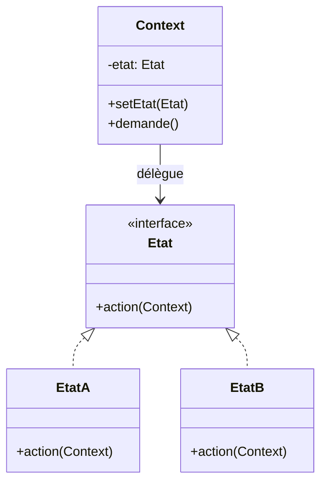
**Explication :**
- `Etat` définit l'interface des états.
- `EtatA` et `EtatB` sont des états concrets.
- `Context` délègue son comportement à l'état courant.

**Quand l'utiliser ?**
- Quand un objet doit changer de comportement dynamiquement selon son état.

**Exemple Java**
```java
interface Etat {
    void action(Context c);
}
class EtatA implements Etat {
    public void action(Context c) {
        System.out.println("Etat A");
        c.setEtat(new EtatB());
    }
}
class EtatB implements Etat {
    public void action(Context c) {
        System.out.println("Etat B");
    }
}
class Context {
    private Etat etat;
    public Context() { etat = new EtatA(); }
    public void setEtat(Etat e) { etat = e; }
    public void demande() { etat.action(this); }
}
// Utilisation
Context ctx = new Context();
ctx.demande(); // Etat A
ctx.demande(); // Etat B
```

## Chain of Responsibility
Permet de passer une requête à travers une chaîne d'objets jusqu'à ce qu'un objet la traite.

**Diagramme de classe :**
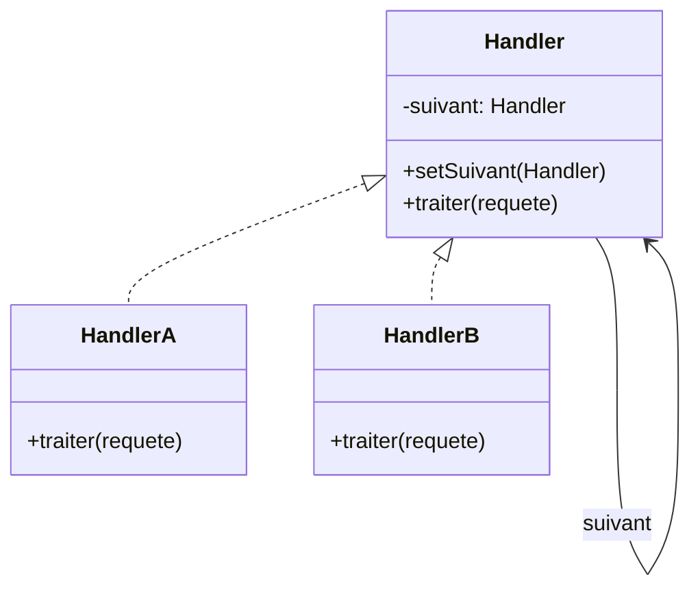
**Explication :**
- `Handler` définit l'interface et la gestion du suivant.
- `HandlerA` et `HandlerB` sont des maillons concrets de la chaîne.
- Chaque handler peut traiter ou passer la requête au suivant.

**Quand l'utiliser ?**
- Quand plusieurs objets peuvent traiter une requête, mais on ne sait pas lequel à l'avance.

**Exemple Java**
```java
abstract class Handler {
    protected Handler suivant;
    public void setSuivant(Handler s) { suivant = s; }
    public abstract void traiter(String requete);
}
class HandlerA extends Handler {
    public void traiter(String requete) {
        if (requete.equals("A")) System.out.println("Traité par A");
        else if (suivant != null) suivant.traiter(requete);
    }
}
class HandlerB extends Handler {
    public void traiter(String requete) {
        if (requete.equals("B")) System.out.println("Traité par B");
        else if (suivant != null) suivant.traiter(requete);
    }
}
// Utilisation
Handler h1 = new HandlerA();
Handler h2 = new HandlerB();
h1.setSuivant(h2);
h1.traiter("B"); // Traité par B
```

## Iterator
Permet de parcourir une collection sans exposer sa structure interne.

**Diagramme de classe :**
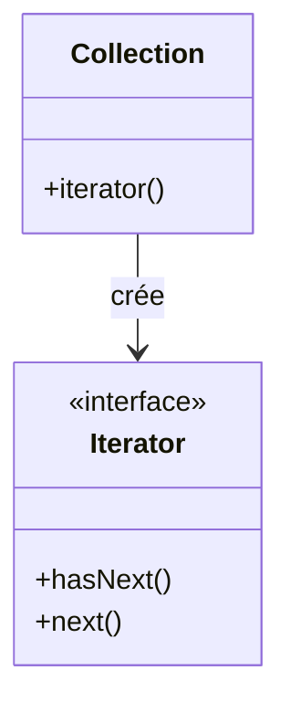
**Explication :**
- `Iterator` définit les méthodes de parcours.
- `Collection` fournit un itérateur pour parcourir ses éléments.

**Quand l'utiliser ?**
- Pour parcourir des collections de manière uniforme.

**Exemple Java**
```java
List<String> liste = new ArrayList<>();
liste.add("a"); liste.add("b");
Iterator<String> it = liste.iterator();
while (it.hasNext()) {
    System.out.println(it.next());
}
```

## Mediator
Le pattern Mediator centralise la communication entre plusieurs objets pour réduire les dépendances directes.

**Diagramme de classe :**
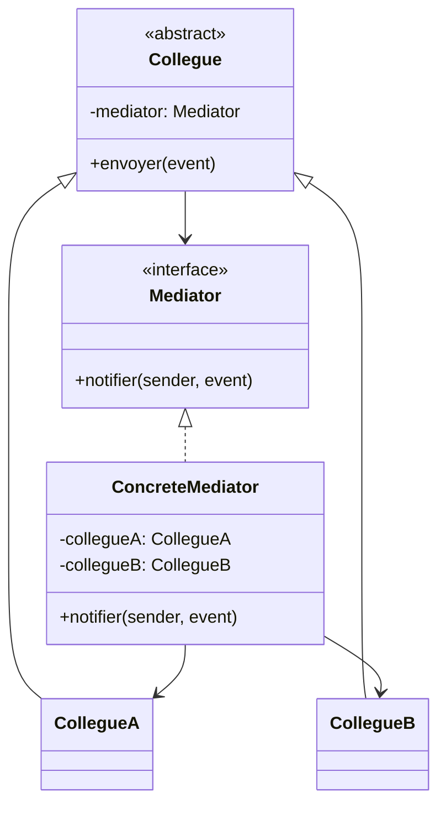
**Explication :**
- `Mediator` définit l'interface de communication.
- `ConcreteMediator` centralise les échanges entre collègues.
- `Collegue` est une classe abstraite pour les objets qui communiquent via le médiateur.

**Exemple Java**
```java
interface Mediator {
    void notifier(Collegue sender, String event);
}
class ConcreteMediator implements Mediator {
    CollegueA a;
    CollegueB b;
    public void setA(CollegueA a) { this.a = a; }
    public void setB(CollegueB b) { this.b = b; }
    public void notifier(Collegue sender, String event) {
        if (sender == a) b.reagir(event);
        else if (sender == b) a.reagir(event);
    }
}
abstract class Collegue {
    protected Mediator mediator;
    public Collegue(Mediator m) { mediator = m; }
    public void envoyer(String event) { mediator.notifier(this, event); }
    public abstract void reagir(String event);
}
class CollegueA extends Collegue {
    public CollegueA(Mediator m) { super(m); }
    public void reagir(String event) { System.out.println("A reçoit: " + event); }
}
class CollegueB extends Collegue {
    public CollegueB(Mediator m) { super(m); }
    public void reagir(String event) { System.out.println("B reçoit: " + event); }
}
```

## Memento
Permet de sauvegarder et restaurer l'état interne d'un objet sans violer son encapsulation.

**Diagramme de classe :**
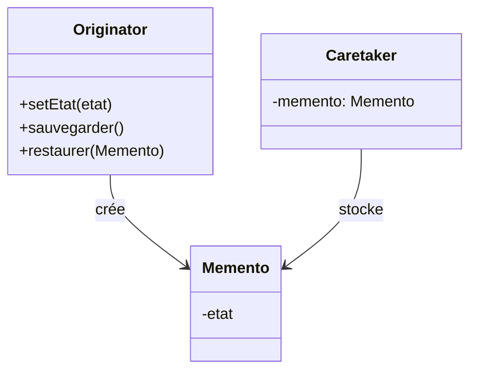
**Explication :**
- `Originator` crée et restaure des objets `Memento`.
- `Memento` stocke l'état interne.
- `Caretaker` garde les mementos sans les modifier.

**Exemple Java**
```java
class Memento {
    private String etat;
    public Memento(String e) { etat = e; }
    public String getEtat() { return etat; }
}
class Originator {
    private String etat;
    public void setEtat(String e) { etat = e; }
    public Memento sauvegarder() { return new Memento(etat); }
    public void restaurer(Memento m) { etat = m.getEtat(); }
}
class Caretaker {
    private Memento memento;
    public void setMemento(Memento m) { memento = m; }
    public Memento getMemento() { return memento; }
}
```

## Template Method
Définit le squelette d'un algorithme dans une méthode, en laissant certaines étapes à des sous-classes.

**Diagramme de classe :**
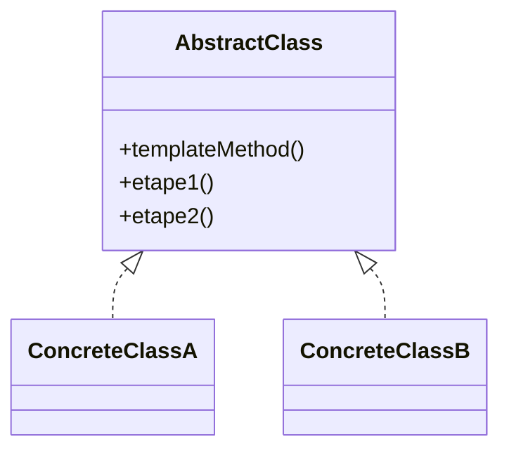
**Explication :**
- `AbstractClass` définit la méthode template et les étapes.
- Les sous-classes implémentent les étapes spécifiques.

**Exemple Java**
```java
abstract class Recette {
    public final void preparer() {
        etape1();
        etape2();
    }
    abstract void etape1();
    abstract void etape2();
}
class RecetteGateau extends Recette {
    void etape1() { System.out.println("Mélanger"); }
    void etape2() { System.out.println("Cuire"); }
}
```

## Visitor
Permet de séparer un algorithme d'une structure d'objets sur laquelle il opère.

**Diagramme de classe :**
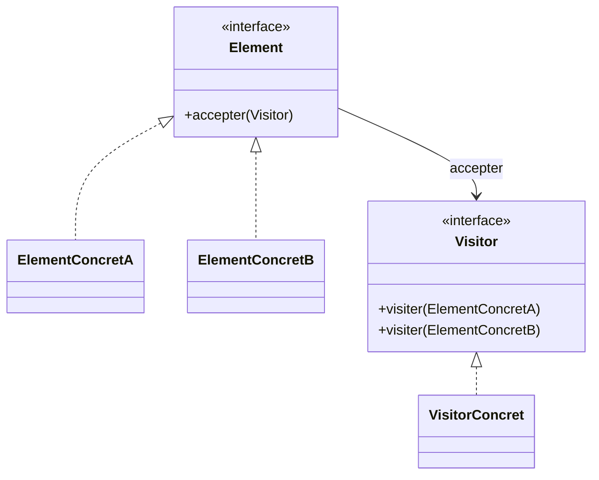
**Explication :**
- `Element` accepte un visiteur.
- `Visitor` définit les opérations à effectuer sur chaque type d'élément.

**Exemple Java**
```java
interface Visitor {
    void visiter(ElementConcretA a);
    void visiter(ElementConcretB b);
}
interface Element {
    void accepter(Visitor v);
}
class ElementConcretA implements Element {
    public void accepter(Visitor v) { v.visiter(this); }
}
class ElementConcretB implements Element {
    public void accepter(Visitor v) { v.visiter(this); }
}
```

## Interpreter
Donne une représentation pour la grammaire d'un langage et un interprète pour traiter les phrases de ce langage.

**Diagramme de classe :**
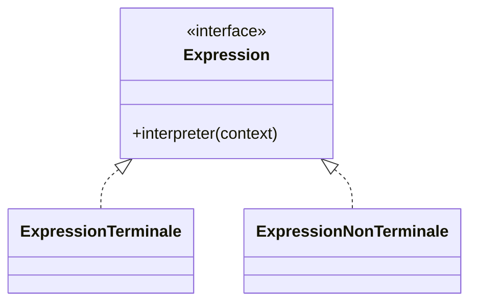
**Explication :**
- `Expression` définit l'interface d'interprétation.
- Les classes concrètes représentent des règles de la grammaire.

**Exemple Java**
```java
interface Expression {
    int interpreter();
}
class Nombre implements Expression {
    private int valeur;
    public Nombre(int v) { valeur = v; }
    public int interpreter() { return valeur; }
}
class Addition implements Expression {
    private Expression gauche, droite;
    public Addition(Expression g, Expression d) { gauche = g; droite = d; }
    public int interpreter() { return gauche.interpreter() + droite.interpreter(); }
}
```

> **À retenir :**
> Ces patterns avancés permettent de structurer des systèmes complexes et évolutifs.
