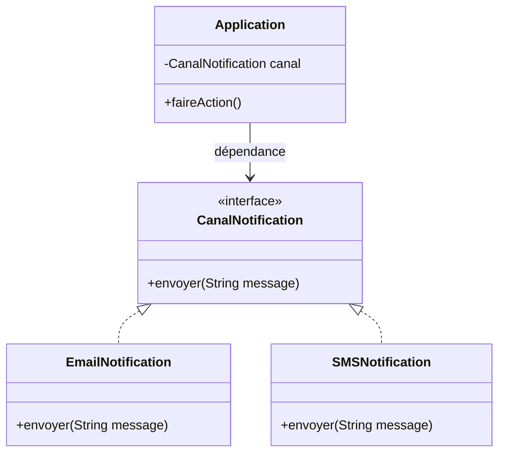

# Les interfaces

Les interfaces sont un concept fondamental de la programmation orientée objet en Java. Elles permettent de définir des contrats que les classes doivent respecter, sans imposer d’implémentation concrète. Cela favorise la flexibilité, le découplage et la réutilisabilité du code.

> **À retenir** : Une interface définit ce qu’une classe doit faire, mais pas comment elle doit le faire.

## Qu'est-ce qu'une interface ?

- Une interface est un ensemble de méthodes publiques que l'on va déclarer mais pas définir (sauf avec le mot-clef `default`).
- On ne peut pas instancier une interface directement.
- Une interface peut contenir :
  - des méthodes abstraites (sans corps)
  - des constantes (`public static final`)
  - des méthodes par défaut (`default`)
  - des méthodes statiques
  - des classes ou interfaces internes
  - des annotations, enums

```java
public interface Perimetrable {
    double getPerimetre();
    default double getSurface() {
        return 0;
    }
}
```

> **Info** : Par convention, le nom d’une interface commence par une majuscule.

## Utilisation d'une interface

- On peut implémenter une interface dans une classe et instancier cette classe. Cette instance a donc deux types : celui de la classe et celui de l’interface.
- On ne peut appeler que les méthodes de l’interface sur une variable du type de l’interface.

```java
interface Perimetrable {
    double getPerimetre();
}

class Carre implements Perimetrable {
    private double cote;
    public Carre(double cote) { this.cote = cote; }
    public double getCote() { return this.cote; }
    @Override
    public double getPerimetre() { return 4 * this.cote; }
}

class Main {
    public static void main(String[] args) {
        Carre c = new Carre(5);
        Perimetrable p = c;
        System.out.println(c.getCote()); // OK
        System.out.println(c.getPerimetre()); // OK
        System.out.println(p.getPerimetre()); // OK
        // System.out.println(p.getCote()); // KO !
    }
}
```

> **À savoir** : On peut caster une variable pour accéder à des méthodes spécifiques à la classe :
>
> ```java
> System.out.println(((Carre)p).getCote()); // OK
> ```

## Implémentation d'une interface

- Utilisation du mot-clef `implements` :

```java
class Forme implements Perimetrable {
    protected Point centre;
    public Forme(Point c) { this.centre = c; }
    public double getPerimetre() { return 0; }
}

class Rectangle extends Forme {
    protected double largeur, longueur;
    public Rectangle(Point centre, double largeur, double longueur) {
        super(centre);
        this.largeur = largeur;
        this.longueur = longueur;
    }
    public double getPerimetre() { return 2 * (this.largeur + this.longueur); }
}
```

## Implémentation de plusieurs interfaces

- Une classe peut implémenter plusieurs interfaces :

```java
public class Forme implements Perimetrable, java.io.Serializable {
    // ...
}
```

- Si deux interfaces héritées ont des méthodes de même signature, il suffit de l’implémenter une seule fois.

## Hiérarchie d'interfaces

- Une interface peut hériter d’une ou plusieurs autres interfaces :

```java
interface Perimetrable {
    double getPerimetre();
}
interface ComplexPerimetrable extends Perimetrable {
    // ...
}
```

- Une interface qui hérite d’une autre interface hérite de toutes ses méthodes.

## Interfaces et UML

En UML, les interfaces sont représentées par le stéréotype `<<interface>>` ou par une classe avec une petite flèche en pointillés.


La flèche en pointillés va de la classe concrète vers l’interface.

## Méthodes par défaut

- Depuis Java 8, une interface peut contenir des méthodes avec une implémentation par défaut :

```java
interface MonInterface {
    default void methodeParDefaut() {
        // implémentation par défaut
    }
}
```

> **Info** : Les méthodes par défaut sont utiles pour faire évoluer une interface sans forcer toutes les classes à réécrire du code.

## Découplage grâce aux interfaces

Le **découplage** consiste à séparer les différentes parties d’un programme pour qu’elles dépendent le moins possible les unes des autres. En Java, cela se fait principalement en programmant contre des **interfaces** plutôt que des classes concrètes. Ainsi, une classe ne connaît que le contrat (l’interface) et non l’implémentation précise.

> **À retenir :** Le découplage permet de rendre le code plus flexible, évolutif et testable. On peut changer l’implémentation sans modifier le code qui l’utilise.

### Exemple sans découplage (couplage fort)

Supposons une application qui doit notifier un utilisateur :

```java
class Notificateur {
    public void envoyerNotification(String message) {
        System.out.println("Envoi d'un email : " + message);
    }
}

class Application {
    private Notificateur notificateur;
    public Application(Notificateur notificateur) {
        this.notificateur = notificateur;
    }
    public void faireAction() {
        // ...
        notificateur.envoyerNotification("Action réalisée !");
    }
}
```

**Problème :** Si on veut envoyer un SMS ou une notification push, il faut modifier la classe `Notificateur` et potentiellement la classe `Application`.

---

### Exemple découplé avec interface

On introduit une interface pour séparer le contrat de l’implémentation :

```java
interface CanalNotification {
    void envoyer(String message);
}

class EmailNotification implements CanalNotification {
    public void envoyer(String message) {
        System.out.println("[EMAIL] " + message);
    }
}

class SMSNotification implements CanalNotification {
    public void envoyer(String message) {
        System.out.println("[SMS] " + message);
    }
}

class Application {
    private CanalNotification canal;
    public Application(CanalNotification canal) {
        this.canal = canal;
    }
    public void faireAction() {
        // ...
        canal.envoyer("Action réalisée !");
    }
}

public class Main {
    public static void main(String[] args) {
        Application appEmail = new Application(new EmailNotification());
        appEmail.faireAction(); // [EMAIL] Action réalisée !
        Application appSMS = new Application(new SMSNotification());
        appSMS.faireAction(); // [SMS] Action réalisée !
    }
}
```

> **Bénéfices :**
> - L’application ne dépend plus d’une implémentation concrète, mais d’une abstraction (l’interface).
> - On peut ajouter de nouveaux canaux (Push, Discord, etc.) sans modifier la classe `Application`.
> - Pour les tests, on peut injecter une fausse implémentation qui enregistre les messages sans rien envoyer.

---

### Schéma UML du découplage



- Les flèches en pointillés montrent l’implémentation de l’interface.
- `Application` dépend uniquement de l’interface `CanalNotification`.

> **Info :** Pour les tests, créez une classe `CanalNotificationTest` qui stocke les messages dans une liste.

---

## Injection de dépendance et interfaces

L’**injection de dépendance** est une technique qui consiste à fournir à une classe ses dépendances (autres objets dont elle a besoin) depuis l’extérieur, plutôt que de les créer elle-même. Cela va plus loin que le simple découplage : on délègue la responsabilité de la création des objets à un autre composant (ou au code appelant).

> **À retenir :**
> - Le découplage est un principe : on programme contre une abstraction (interface).
> - L’injection de dépendance est une technique : on fournit les dépendances à la classe, souvent via le constructeur (ou un setter).
> - L’injection de dépendance exploite le découplage pour rendre le code encore plus flexible et testable.

### Exemple : notification avec injection de dépendance

On injecte la dépendance via le constructeur :

```java
class Application {
    private CanalNotification canal;
    public Application(CanalNotification canal) {
        this.canal = canal;
    }
    public void faireAction() {
        canal.envoyer("Action réalisée !");
    }
}

// ...
Application app = new Application(new EmailNotification());
```

> **Pédagogie :**
> - On peut injecter n’importe quelle implémentation de l’interface.
> - On peut injecter une fausse implémentation pour les tests (mock).
> - Cela facilite l’évolution du code et le respect du principe d’inversion de dépendance (SOLID).

---

> **Résumé :**
> - Le découplage permet de programmer contre une interface.
> - L’injection de dépendance permet de choisir dynamiquement l’implémentation à utiliser, ce qui rend le code modulaire, testable et évolutif.

*L’injection de dépendance est un pilier de la conception modulaire et testable en Java. Essayez de l’appliquer dans vos projets pour gagner en flexibilité et en qualité de code !*

---

*La section sur les interfaces fonctionnelles et les lambdas est traitée dans le chapitre 19.*

---

## Encadré : SOLID et interfaces

Les interfaces jouent un rôle clé dans deux principes SOLID :
- **D** (Dependency Inversion Principle) : Dépendre des abstractions (interfaces), pas des implémentations concrètes.
- **I** (Interface Segregation Principle) : Mieux vaut plusieurs petites interfaces spécifiques qu’une grosse interface générale.

> **À retenir :** Les interfaces permettent d’appliquer ces principes pour rendre le code plus flexible, modulaire et testable.

Pour une explication complète des principes SOLID, voir le chapitre dédié.
