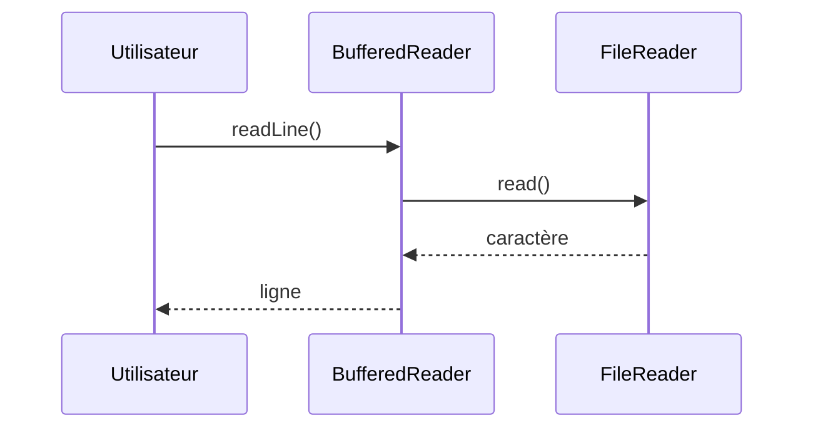
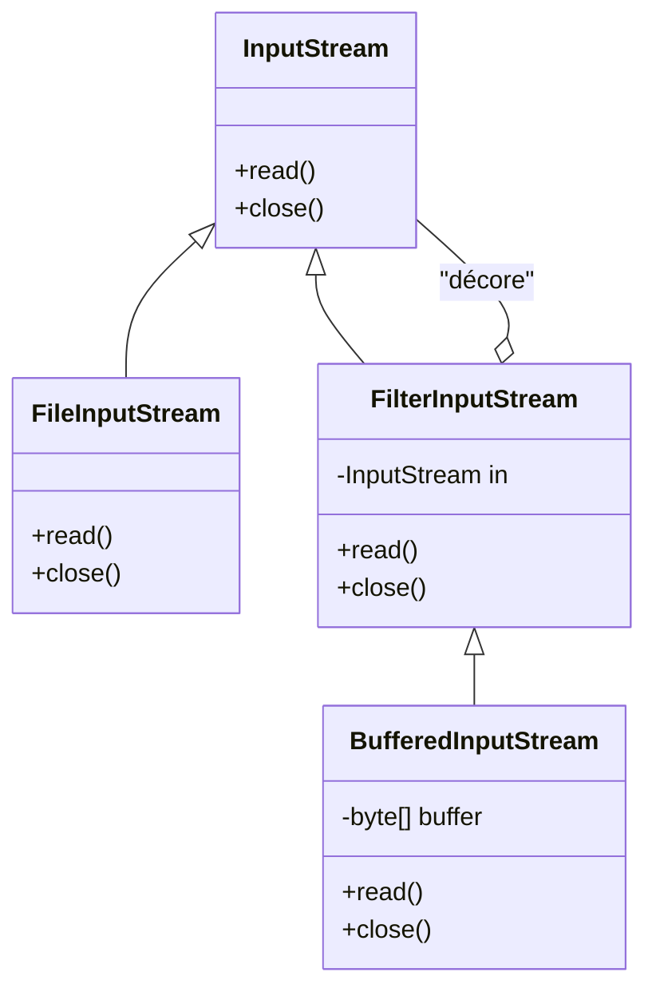

# La gestion de fichiers en Java

La gestion des fichiers est une compétence essentielle en Java. Ce chapitre présente les différentes manières de manipuler des fichiers (création, lecture, écriture, suppression), les classes à utiliser selon le contexte (texte, binaire, objets), les bonnes pratiques et un comparatif des approches classiques et modernes.

> **À retenir :** Java propose plusieurs API pour manipuler les fichiers. Le choix dépend du type de données, des performances attendues et de la simplicité du code.

---

## 1. La classe `File` : base de la gestion de fichiers

La classe `File` permet de représenter un fichier ou un dossier du système. Elle sert à obtenir des informations, créer, supprimer ou manipuler des fichiers/dossiers.

```java
File file = new File("monFichier.txt");
boolean exists = file.exists(); // Le fichier existe-t-il ?
String chemin = file.getAbsolutePath(); // Chemin absolu
String nom = file.getName(); // Nom du fichier
boolean isDir = file.isDirectory(); // Est-ce un dossier ?
```

- Créer un fichier : `file.createNewFile();`
- Créer un dossier : `file.mkdir();` ou `file.mkdirs();`
- Supprimer : `file.delete();`
- Lister le contenu d’un dossier : `file.listFiles();`

> **Info :** `File` ne lit/écrit pas le contenu, il gère la structure (présence, nom, chemin, etc.).

---

## 2. Lire et écrire dans un fichier texte

Pour manipuler du texte, on utilise `FileReader`/`FileWriter` (lecture/écriture caractère par caractère) ou `BufferedReader`/`BufferedWriter` (lecture/écriture optimisée par tampon).

### Exemple : lecture et écriture texte

```java
File file = new File("monFichier.txt");
FileWriter fw = new FileWriter(file);
fw.write("Hello World !");
fw.close();

FileReader fr = new FileReader(file);
int c;
while ((c = fr.read()) != -1) {
    System.out.print((char) c);
}
fr.close();
```

> **Pédagogie :** Utilisez toujours `close()` pour libérer les ressources, ou mieux, le try-with-resources (voir plus bas).

---

## 3. Lire et écrire dans un fichier binaire

Pour manipuler des données binaires (octets), on utilise `FileInputStream`/`FileOutputStream`.

```java
File file = new File("monFichier.txt");
FileOutputStream fos = new FileOutputStream(file);
fos.write("Hello World !".getBytes());
fos.close();

FileInputStream fis = new FileInputStream(file);
int b;
while ((b = fis.read()) != -1) {
    System.out.print((char) b);
}
fis.close();
```

> **Info :** Utilisez les flux binaires pour les images, sons, fichiers compressés, etc.

---

## 4. Bufferisation, décorateurs et design pattern

Les classes comme `BufferedReader`, `BufferedWriter`, `BufferedInputStream`, `BufferedOutputStream` servent à optimiser les accès disque en utilisant un tampon (buffer).

### Exemple d'utilisation de buffer en Java

Supposons que l’on souhaite lire un fichier texte ligne par ligne de façon performante :

```java
try (BufferedReader br = new BufferedReader(new FileReader("monFichier.txt"))) {
    String ligne;
    while ((ligne = br.readLine()) != null) {
        System.out.println(ligne);
    }
} catch (IOException e) {
    e.printStackTrace();
}
```

Ici, `BufferedReader` ajoute un tampon pour accélérer la lecture, et délègue la lecture réelle à un `FileReader`.

### Diagramme de séquence : comment les objets se parlent



### Design pattern décorateur

En Java, les flux (InputStream, OutputStream, Reader, Writer) sont souvent utilisés comme des **décorateurs**. Ils permettent d’ajouter des fonctionnalités supplémentaires à un flux de base sans modifier sa structure.

On peut les « empiler » pour combiner leurs fonctionnalités, selon le **design pattern décorateur**.

> **Concept avancé :** Le décorateur permet d’ajouter dynamiquement des fonctionnalités à un flux sans modifier sa structure de base. Chaque flux (InputStream, OutputStream, Reader, Writer) peut être « décoré » par d’autres pour ajouter des capacités (bufferisation, chiffrement, compression, etc.).

### Illustration UML du pattern décorateur appliqué aux flux Java



- `FileInputStream` lit les octets depuis un fichier.
- `FilterInputStream` est une classe abstraite qui permet de décorer un autre `InputStream`.
- `BufferedInputStream` ajoute un tampon pour accélérer la lecture, sans changer l’interface.

> **Info :** On peut empiler plusieurs décorateurs (buffer, chiffrement, compression, etc.) pour composer des comportements complexes.

### Exemple avancé : ajout d’un décorateur personnalisé

Supposons que vous vouliez créer un flux qui compte le nombre d’octets lus :

```java
class CountingInputStream extends FilterInputStream {
    private int count = 0;
    public CountingInputStream(InputStream in) {
        super(in);
    }
    @Override
    public int read() throws IOException {
        int b = super.read();
        if (b != -1) count++;
        return b;
    }
    public int getCount() { return count; }
}

// Utilisation
try (CountingInputStream cis = new CountingInputStream(new BufferedInputStream(new FileInputStream("fichier.txt")))) {
    while (cis.read() != -1) {}
    System.out.println("Octets lus : " + cis.getCount());
}
```

> **Pédagogie :** Le pattern décorateur permet d’ajouter des fonctionnalités sans modifier les classes existantes, en respectant le principe « open/closed » (ouvert à l’extension, fermé à la modification).

---

## 5. Le try-with-resources : gestion automatique des ressources

Depuis Java 7, le try-with-resources permet d’ouvrir un ou plusieurs flux dans la déclaration du `try`, et garantit leur fermeture automatique, même en cas d’exception ou de retour anticipé.

**Exemple avancé : plusieurs ressources**

```java
try (
    FileInputStream fis = new FileInputStream("entree.txt");
    FileOutputStream fos = new FileOutputStream("sortie.txt");
    BufferedInputStream bis = new BufferedInputStream(fis);
    BufferedOutputStream bos = new BufferedOutputStream(fos)
) {
    int b;
    while ((b = bis.read()) != -1) {
        bos.write(b);
    }
} catch (IOException e) {
    e.printStackTrace();
}
// Toutes les ressources sont fermées automatiquement ici
```

> **À savoir :** Le try-with-resources fonctionne avec toute classe qui implémente l’interface `AutoCloseable` (presque tous les flux Java, mais aussi des connexions réseau, bases de données, etc.).

> **Pédagogie :** Cela évite les fuites de ressources, les oublis de fermeture, et rend le code plus sûr et plus lisible.

---

## 6. Sérialisation d’objets

Pour sauvegarder et relire des objets Java, on utilise `ObjectOutputStream` et `ObjectInputStream` (sérialisation/désérialisation).

```java
ObjectOutputStream oos = new ObjectOutputStream(new FileOutputStream("fichier.obj"));
oos.writeObject(new Personne("Dupont", "Jean", 25));
oos.close();

ObjectInputStream ois = new ObjectInputStream(new FileInputStream("fichier.obj"));
Personne p = (Personne) ois.readObject();
ois.close();
```

> **À savoir :** La classe à sérialiser doit implémenter `Serializable`.

---

## 7. Lecture/écriture moderne : NIO (Files, Paths, etc.)

Depuis Java 7, l’API NIO permet de manipuler les fichiers de façon plus simple et performante :

```java
List<String> lignes = Files.readAllLines(Paths.get("fichier.txt"), StandardCharsets.UTF_8);
lignes.forEach(System.out::println);

Files.write(Paths.get("fichier.txt"), Arrays.asList("Ligne 1", "Ligne 2"), StandardCharsets.UTF_8);
```

- Lecture ligne par ligne :
```java
try (Stream<String> stream = Files.lines(Paths.get("fichier.txt"))) {
    stream.forEach(System.out::println);
}
```

> **Info :** L’API NIO permet aussi de copier, déplacer, supprimer, surveiller des fichiers, etc.

---

## 8. Comparatif des approches

| Critère                | BufferedReader         | Scanner                | NIO (Files, Paths)      |
|------------------------|-----------------------|------------------------|-------------------------|
| Performance            | +++                   | ++                     | +++                     |
| Simplicité             | ++                    | +++                    | +++                     |
| Lecture ligne/ligne    | Oui                   | Oui                    | Oui                     |
| Lecture mot/valeur     | Non                   | Oui                    | Non                     |
| Lecture binaire        | Non                   | Non                    | Oui                     |
| API moderne            | Non                   | Non                    | Oui                     |

> **Conseil :** Choisissez l’API adaptée à votre besoin : NIO pour la modernité et la polyvalence, Scanner pour l’analyse de texte, BufferedReader pour la performance sur de gros fichiers texte.

---

## 9. Bonnes pratiques

- Toujours fermer les flux (ou utiliser try-with-resources)
- Gérer les exceptions (fichiers manquants, droits, etc.)
- Privilégier l’API NIO pour les nouveaux projets
- Utiliser la sérialisation pour sauvegarder des objets
