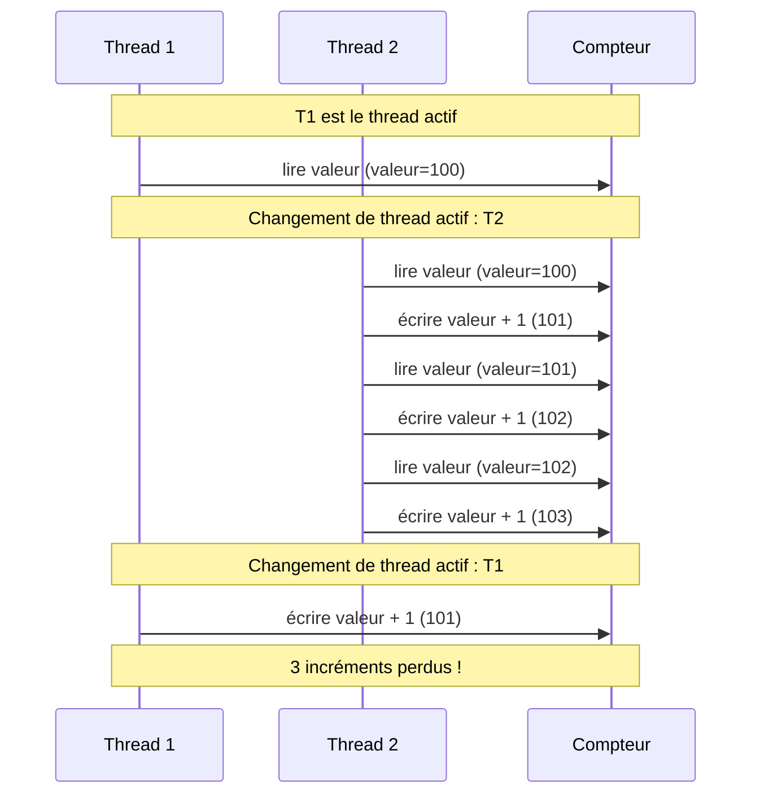

# Le multithreading en Java

## Introduction

Dans la vie quotidienne, nous faisons souvent plusieurs choses en même temps : écouter de la musique en cuisinant, discuter tout en marchant, etc. De la même façon, un programme informatique peut avoir besoin d’exécuter plusieurs tâches simultanément. C’est ce que permet le multithreading.

Le multithreading, ou « multitâche », consiste à exécuter plusieurs fils d’exécution (threads) dans un même programme. Cela permet, par exemple, de continuer à répondre à l’utilisateur pendant qu’un calcul long s’effectue en arrière-plan, ou de gérer plusieurs connexions réseau en même temps.

## Pourquoi utiliser le multithreading ?

Imaginons une application qui doit télécharger un fichier sur Internet tout en affichant une barre de progression. Sans multithreading, le programme serait bloqué pendant le téléchargement, et l’interface ne répondrait plus. Avec le multithreading, un thread s’occupe du téléchargement, pendant qu’un autre continue à gérer l’interface graphique.

Le multithreading est donc essentiel pour :
- Améliorer la réactivité des applications.
- Exploiter les processeurs multi-cœurs.
- Gérer des tâches indépendantes ou longues (calculs, accès disque, réseau, etc.).

## Qu’est-ce qu’un thread ?

Un thread (ou « fil d’exécution ») est une séquence d’instructions qui s’exécute indépendamment des autres. Un programme Java démarre toujours avec un thread principal (main), mais il est possible d’en créer d’autres.

### Créer un thread en Java

Il existe deux façons principales de créer un thread :
1. **Étendre la classe Thread**
2. **Implémenter l’interface Runnable**

#### 1. Étendre la classe Thread

On peut créer une classe qui hérite de `Thread` et redéfinir la méthode `run()` :

```java
public class MonThread extends Thread {
    public void run() {
        System.out.println("Thread lancé !");
    }
}

public class Main {
    public static void main(String[] args) {
        MonThread t = new MonThread();
        t.start(); // Lance le thread (appelle run() dans un nouveau fil)
    }
}
```

::: info
**Attention** : Il ne faut jamais appeler directement la méthode `run()` ! Il faut utiliser `start()`, qui crée réellement un nouveau thread.
:::

#### 2. Implémenter l’interface Runnable

C’est la méthode la plus courante et la plus souple. On définit le code à exécuter dans la méthode `run()` d’un objet qui implémente `Runnable` :

```java
public class Tache implements Runnable {
    public void run() {
        System.out.println("Tâche exécutée dans un thread");
    }
}

public class Main {
    public static void main(String[] args) {
        Thread t = new Thread(new Tache());
        t.start();
    }
}
```

Depuis Java 8, on peut utiliser une expression lambda pour plus de concision :

```java
Thread t = new Thread(() -> {
    System.out.println("Thread avec Runnable");
});
t.start();
```

## Attendre la fin d’un thread : la méthode `join()`

Quand on lance plusieurs threads, il arrive qu’on veuille attendre qu’ils aient tous terminé avant de continuer. C’est le rôle de la méthode `join()`.

Par exemple, dans l’exemple précédent :
```java
public class Main {
    public static void main(String[] args) throws InterruptedException {
        Thread t1 = new Thread(() -> {
            try {
                Thread.sleep(2000); // Simule un travail long
                System.out.println("Tâche 1 terminée");
            } catch (InterruptedException e) {
                e.printStackTrace();
            }
        });

        Thread t2 = new Thread(() -> {
            try {
                Thread.sleep(1000); // Simule un travail plus court
                System.out.println("Tâche 2 terminée");
            } catch (InterruptedException e) {
                e.printStackTrace();
            }
        });

        t1.start();
        t2.start();

        t1.join(); // Attend que t1 se termine
        t2.join(); // Attend que t2 se termine

        System.out.println("Toutes les tâches sont terminées !");
    }
}
```

::: info
Ici, `join()` garantit que le message final ne s'affiche qu'après la fin des deux threads, même si leur durée d'exécution est différente.
:::

## La synchronisation : éviter les problèmes de concurrence

Quand plusieurs threads accèdent aux mêmes données, il peut y avoir des conflits (par exemple, deux threads qui modifient la même variable en même temps). Pour éviter ces problèmes, il faut synchroniser l’accès aux ressources partagées.

Le mot-clé `synchronized` permet de protéger une section de code : un seul thread à la fois peut l’exécuter.

```java
synchronized(monObjet) {
    // Code protégé : un seul thread à la fois peut entrer ici
}
```

Il existe aussi d’autres outils plus avancés (verrous, sémaphores, etc.), mais `synchronized` suffit dans la plupart des cas simples.

## Exemple concret : pourquoi `synchronized` est indispensable

Prenons un exemple classique : deux threads qui incrémentent un compteur partagé. Sans synchronisation, le résultat final peut être incorrect à cause des accès concurrents.

### Sans `synchronized` (résultat inattendu)
```java
public class Compteur {
    private int valeur = 0;
    public void incrementer() {
        valeur = valeur + 1;
    }
    public int getValeur() { return valeur; }
}

public class Main {
    public static void main(String[] args) throws InterruptedException {
        Compteur c = new Compteur();
        Thread t1 = new Thread(() -> { for (int i = 0; i < 100000; i++) c.incrementer(); });
        Thread t2 = new Thread(() -> { for (int i = 0; i < 100000; i++) c.incrementer(); });
        t1.start(); t2.start();
        t1.join(); t2.join();
        System.out.println("Résultat attendu : 200000");
        System.out.println("Résultat réel : " + c.getValeur());
    }
}
```

::: warning Attention
Ici, le résultat affiché sera souvent inférieur à 200000 ! Pourquoi ? Parce que les deux threads peuvent lire la même valeur en même temps, l’incrémenter, puis l’écrire, ce qui fait perdre des incréments.
:::



Ce diagramme montre que si deux threads lisent la même valeur en même temps, ils peuvent tous deux calculer la même nouvelle valeur et l’écrire, ce qui fait perdre un incrément. C’est le cœur du problème de concurrence sans synchronisation.

### Avec `synchronized` (résultat correct)
```java
public class Compteur {
    private int valeur = 0;
    public synchronized void incrementer() {
        valeur = valeur + 1;
    }
    public int getValeur() { return valeur; }
}

public class Main {
    public static void main(String[] args) throws InterruptedException {
        Compteur c = new Compteur();
        Thread t1 = new Thread(() -> { for (int i = 0; i < 100000; i++) c.incrementer(); });
        Thread t2 = new Thread(() -> { for (int i = 0; i < 100000; i++) c.incrementer(); });
        t1.start(); t2.start();
        t1.join(); t2.join();
        System.out.println("Résultat attendu : 200000");
        System.out.println("Résultat réel : " + c.getValeur());
    }
}
```

::: info
Cette fois, chaque incrément est protégé : un seul thread à la fois peut exécuter la méthode `incrementer()`. Le résultat sera toujours 200000.
:::

### Explication
- **Sans `synchronized`** : plusieurs threads peuvent modifier la variable en même temps, ce qui provoque des erreurs subtiles et imprévisibles (problème de « condition de course »).
- **Avec `synchronized`** : l’accès à la ressource partagée est séquentialisé, donc le résultat est fiable.

Cet exemple montre que le multithreading sans synchronisation peut donner des résultats faux, même si le code semble correct. Il est donc crucial de protéger les accès concurrents aux données partagées !


### Deux formes de `synchronized`

Il existe deux façons principales d’utiliser `synchronized` en Java :

1. **Sur une méthode** : toute la méthode est protégée, un seul thread à la fois peut l’exécuter sur un même objet.

```java
public synchronized void incrementer() {
    valeur = valeur + 1;
}
```

2. **Sur un bloc de code** : on protège seulement une partie du code, et on choisit explicitement l’objet servant de verrou.

```java
public void incrementer() {
    synchronized(this) {
        valeur = valeur + 1;
    }
}
```

On peut aussi synchroniser sur un autre objet que `this` si on veut contrôler plus finement la concurrence.

```java
private final Object verrou = new Object();
public void incrementer() {
    synchronized(verrou) {
        valeur = valeur + 1;
    }
}
```

::: info
Synchroniser une méthode (`synchronized` sur la méthode) revient à écrire `synchronized(this)` autour de tout le code de la méthode. Synchroniser un bloc permet de limiter la zone critique ou de choisir un autre verrou.
:::


## Conseils pratiques

- Toujours utiliser `start()` pour lancer un thread.
- Éviter de partager des variables entre threads si possible.
- Protéger l’accès aux ressources partagées avec `synchronized` ou d’autres mécanismes.
- Tester soigneusement les programmes multithreadés : les bugs sont souvent rares et difficiles à reproduire.

## Pour aller plus loin

Java propose aussi des outils plus évolués pour gérer les threads : le framework `java.util.concurrent`, les pools de threads, les tâches asynchrones (`Future`, `Callable`), etc. Ces outils facilitent la gestion de nombreux threads et offrent plus de contrôle.

---

Le multithreading est un sujet vaste et passionnant. Il permet de concevoir des programmes plus puissants, mais demande rigueur et méthode pour éviter les pièges de la concurrence.
