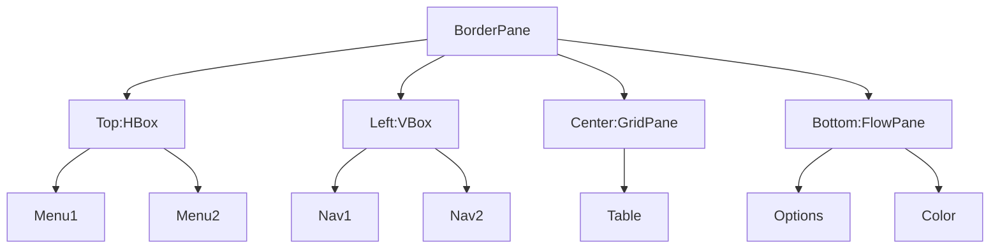

# Les layouts JavaFX

Les layouts (ou « gestionnaires de disposition ») sont des outils fondamentaux pour organiser les composants graphiques dans une fenêtre JavaFX. Ils permettent de structurer l’interface de façon claire, flexible et responsive, sans avoir à calculer manuellement la position de chaque élément.

::: info
Un bon choix de layout rend votre interface plus lisible, plus facile à maintenir et plus agréable à utiliser.
:::

## AnchorPane

L’`AnchorPane` permet de positionner précisément les noeuds enfants à l’aide de coordonnées ou de contraintes d’ancrage. C’est le layout à privilégier si vous souhaitez placer des éléments à des endroits bien précis, ou si vous voulez qu’ils restent « accrochés » à un bord lors du redimensionnement de la fenêtre.

- On peut ancrer chaque noeud à un ou plusieurs bords (haut, bas, gauche, droite).
- On peut aussi placer les noeuds selon des coordonnées relatives à l’`AnchorPane`.
- Pratique pour des interfaces où la position exacte des éléments est importante (ex : tableaux de boutons, jeux, etc.).

### Exemple d'utilisation

```java
AnchorPane ap = new AnchorPane();
Button b = new Button("Test");
Button b2 = new Button("Test 2");
ap.getChildren().addAll(b, b2);
b2.setLayoutX(20.0);
b2.setLayoutY(10.0);
```

**Explication :**
Cet exemple crée un `AnchorPane` et y place deux boutons. Le second bouton est positionné à 20 pixels à droite et 10 pixels en dessous du coin supérieur gauche du conteneur grâce à `setLayoutX` et `setLayoutY`.

On peut aussi générer une grille de boutons dynamiquement :
```java
for(int i = 0; i < 10; i++) {
    for(int j = 0; j < 10; j++) {
        Button button = new Button(Integer.toString(i * 10 + j));
        ap.getChildren().add(button);
        button.setPrefWidth(40);
        button.setPrefHeight(40);
        button.setLayoutX(i * 40);
        button.setLayoutY(j * 40);
        button.setOnMouseClicked(e -> {
            Button b = (Button)e.getSource();
            b.setText(Integer.toString(e.getClickCount()));
        });
    }
}
```

::: info
L’AnchorPane donne une grande liberté, mais attention à la lisibilité et à l’adaptabilité de l’interface lors du redimensionnement de la fenêtre.
:::

## FlowPane

Le `FlowPane` dispose les noeuds horizontalement (ou verticalement) les uns à la suite des autres. Quand il n’y a plus de place, il passe automatiquement à la ligne suivante (ou à la colonne suivante).

- Les noeuds n’empiètent jamais les uns sur les autres.
- Idéal pour des listes d’éléments de taille variable ou pour des galeries d’images.

### Exemple d'utilisation

```java
FlowPane flow = new FlowPane();
flow.getChildren().addAll(
    new Button("Bouton 1"),
    new Button("Bouton 2"),
    new Button("Bouton 3")
);
```

**Explication :**
Ici, un `FlowPane` est créé et trois boutons sont ajoutés. Ils seront disposés horizontalement (par défaut), et passeront à la ligne si la fenêtre est trop étroite.

## GridPane

Le `GridPane` organise les noeuds dans une grille composée de lignes et de colonnes.

- On peut placer chaque noeud à la cellule voulue, et même lui faire occuper plusieurs lignes ou colonnes.
- Idéal pour les formulaires, les tableaux de boutons, les claviers virtuels, etc.
- On peut spécifier la taille d’un noeud dans la grille.

### Exemple d'utilisation

```java
GridPane grid = new GridPane();
grid.add(new Label("Nom :"), 0, 0);
grid.add(new TextField(), 1, 0);
grid.add(new Label("Prénom :"), 0, 1);
grid.add(new TextField(), 1, 1);
```

**Explication :**
Ce code crée un `GridPane` et y place des labels et des champs de texte dans une grille : chaque cellule est repérée par ses coordonnées (colonne, ligne).

## HBox et VBox

- **HBox** (Horizontal Box) : aligne les enfants horizontalement, de gauche à droite.
- **VBox** (Vertical Box) : aligne les enfants verticalement, de haut en bas.

::: info
HBox = « Horizontal Box », VBox = « Vertical Box ». Retenez la logique !
:::

- Ces layouts sont parfaits pour organiser des barres d’outils, des menus, ou des listes d’éléments.

### Exemple d'utilisation HBox

```java
HBox hbox = new HBox(10, new Button("OK"), new Button("Annuler"));
```

**Explication :**
Un `HBox` est créé avec un espacement de 10 pixels entre les boutons "OK" et "Annuler", qui seront alignés horizontalement.

### Exemple d'utilisation VBox

```java
VBox vbox = new VBox(10, new Label("Titre"), new TextField(), new Button("Valider"));
```

**Explication :**
Un `VBox` est créé avec un espacement de 10 pixels entre chaque élément : un label, un champ de texte et un bouton, tous alignés verticalement.

## ScrollPane

Le `ScrollPane` ajoute automatiquement des barres de défilement à son contenu si celui-ci dépasse la taille de la fenêtre.

- Pratique pour afficher de grandes images, des listes longues, ou des zones de texte volumineuses.

### Exemple d'utilisation

```java
ScrollPane scroll = new ScrollPane(new TextArea("Texte très long..."));
```

**Explication :**
Un `ScrollPane` est créé pour contenir une zone de texte. Si le texte dépasse la taille visible, des barres de défilement apparaîtront automatiquement.

## Accordion

L’`Accordion` permet d’afficher des panneaux repliables/dépliables (système de « dropdown »).

- On peut y mettre n’importe quel contenu (texte, boutons, images, etc.).
- Idéal pour organiser des informations secondaires ou des options avancées.

### Exemple d'utilisation

```java
Accordion accordion = new Accordion();
TitledPane pane1 = new TitledPane("Section 1", new Label("Contenu 1"));
TitledPane pane2 = new TitledPane("Section 2", new Label("Contenu 2"));
accordion.getPanes().addAll(pane1, pane2);
```

**Explication :**
Cet exemple crée un `Accordion` avec deux sections repliables, chacune contenant un label. L'utilisateur peut ouvrir ou fermer chaque section.

## SplitPane

Le `SplitPane` sépare la fenêtre en plusieurs parties redimensionnables par l’utilisateur (verticalement ou horizontalement).

- L’utilisateur peut régler la taille des différentes parties à l’aide d’un curseur.
- Pratique pour des interfaces à panneaux multiples (ex : explorateur de fichiers, éditeur de texte avec aperçu, etc.).

### Exemple d'utilisation

```java
SplitPane split = new SplitPane(
    new ListView<>(),
    new TextArea()
);
```

**Explication :**
Un `SplitPane` est créé avec deux zones : une liste à gauche et une zone de texte à droite. L'utilisateur peut ajuster la taille de chaque zone avec le séparateur.


## TabPane et Tab

- **TabPane** : conteneur d’onglets.
- **Tab** : chaque onglet peut contenir une interface différente. Une fois sélectionné, son contenu est affiché.
- Parfait pour organiser des interfaces complexes ou regrouper des fonctionnalités par thème.

### Exemple d'utilisation

```java
TabPane tabPane = new TabPane();
Tab tab1 = new Tab("Accueil", new Label("Bienvenue !"));
Tab tab2 = new Tab("Paramètres", new Label("Réglages..."));
tabPane.getTabs().addAll(tab1, tab2);
```

**Explication :**
Un `TabPane` est créé avec deux onglets : "Accueil" et "Paramètres", chacun affichant un contenu différent.

## BorderPane

Le `BorderPane` divise l’espace en cinq zones : haut, bas, gauche, droite, centre.

- Le centre prend toute la place restante, les autres zones prennent juste la place nécessaire.
- Pratique pour organiser des interfaces complexes (ex : menu en haut, navigation à gauche, contenu principal au centre).


### Exemple d'utilisation

```java
BorderPane border = new BorderPane();
border.setTop(new Label("Haut"));
border.setLeft(new Label("Gauche"));
border.setCenter(new Label("Centre"));
border.setRight(new Label("Droite"));
border.setBottom(new Label("Bas"));
```

**Explication :**
Un `BorderPane` est créé et chaque zone (haut, gauche, centre, droite, bas) reçoit un label. Le centre occupe tout l'espace restant.

::: tip
Bien choisir son layout, c’est la clé d’une interface claire, adaptable et agréable à utiliser !
:::

## Composer des interfaces avec plusieurs layouts

Dans une application JavaFX, il est très courant de combiner plusieurs layouts pour obtenir une interface riche, structurée et ergonomique. Chaque layout a ses points forts : en les imbriquant intelligemment, on peut répondre à tous les besoins d’organisation.

::: info
Pensez votre interface comme un puzzle : chaque zone peut utiliser le layout le plus adapté à son contenu.
:::

### Exemple de composition

Imaginons une application avec :
- Un menu en haut
- Une barre latérale à gauche
- Un contenu principal au centre
- Un panneau d’options en bas

On peut utiliser un `BorderPane` comme structure principale :
```java
BorderPane root = new BorderPane();
root.setTop(new HBox(new Button("Menu 1"), new Button("Menu 2")));
root.setLeft(new VBox(new Button("Navigation 1"), new Button("Navigation 2")));
root.setCenter(new GridPane()); // Par exemple, un tableau de données
root.setBottom(new FlowPane(new Label("Options"), new ColorPicker()));
```

Chaque zone du `BorderPane` peut elle-même contenir un autre layout (HBox, VBox, GridPane, etc.), qui organise ses propres enfants.




Ce diagramme montre comment chaque zone du `BorderPane` peut contenir un layout différent, chacun organisant ses propres composants.


### Conseils pour bien composer
- **Découpez visuellement votre interface** en zones logiques (menu, navigation, contenu, etc.).
- **Choisissez le layout le plus adapté** à chaque zone.
- **N’hésitez pas à imbriquer** plusieurs layouts pour obtenir la structure désirée.
- **Testez le redimensionnement** de la fenêtre pour vérifier que tout reste lisible et harmonieux.

::: tip
La puissance de JavaFX vient de la possibilité de combiner librement tous les layouts : c’est la clé pour des interfaces professionnelles et agréables à utiliser.
:::
