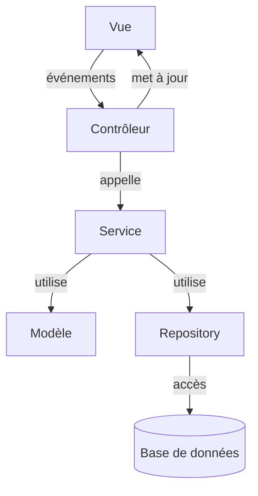

# Les services dans l'architecture MVC

Dans une application moderne, le modèle MVC peut être enrichi par l'ajout d'une couche de **services**. Cette couche permet de séparer la logique métier complexe ou réutilisable du modèle lui-même, et d'améliorer la clarté et la maintenabilité du code.

::: info
Un service, c'est un « cerveau » qui applique les règles métier, alors que le modèle ne fait que stocker les données.
:::

## Qu'est-ce qu'un service ?
Un service est une classe qui contient des méthodes métier (ex : calculs, règles de gestion, traitements sur les données) qui ne relèvent pas directement d'un seul modèle.

- Il peut utiliser plusieurs modèles à la fois.
- Il centralise la logique métier pour éviter la duplication de code.
- Il facilite l'évolution des règles métier sans toucher à la structure des données.

## Pourquoi utiliser des services ?
- **Centraliser** la logique métier complexe ou partagée
- **Faciliter** la réutilisation du code
- **Alléger** les modèles et les contrôleurs
- **Favoriser** les tests unitaires (on peut tester un service indépendamment du reste)

::: tip
Un service ne gère ni l'affichage, ni la persistance : il ne fait que de la logique métier.
:::

## Exemple simple
Voici un exemple de service pour le modèle `Personne` :

```java
public class PersonneService {
    public boolean estMajeur(Personne personne) {
        return personne.getAge() >= 18;
    }
    // Autres méthodes métier...
}
```

On peut ensuite utiliser ce service dans un contrôleur ou un autre service :

```java
public class PersonneController {
    private PersonneService service = new PersonneService();
    public void afficherStatut(Personne personne) {
        if (service.estMajeur(personne)) {
            System.out.println(personne.getPrenom() + " est majeur(e)");
        } else {
            System.out.println(personne.getPrenom() + " est mineur(e)");
        }
    }
}
```

---

## Exemple avancé : service qui utilise un repository

Un service peut aussi utiliser un repository pour appliquer une logique métier sur des données persistantes.

```java
public class PersonneService {
    private final PersonneRepository repository;
    public PersonneService(PersonneRepository repository) {
        this.repository = repository;
    }
    // Retourne toutes les personnes majeures
    public List<Personne> getPersonnesMajores() {
        return repository.findAll().stream()
            .filter(this::estMajeur)
            .collect(Collectors.toList());
    }
    public boolean estMajeur(Personne personne) {
        return personne.getAge() >= 18;
    }
}
```

::: info
Injecter le repository dans le service permet de tester le service avec une base réelle ou simulée (en mémoire).
:::

---

## Cas d’utilisation spécifiques

- **Calculs complexes** : Un service peut calculer le salaire net à partir de plusieurs modèles (employé, fiche de paie, taux d’imposition, etc.).
- **Vérification de règles métier** : Par exemple, vérifier qu’un utilisateur a le droit d’effectuer une action (accès à une ressource, validation d’un panier, etc.).
- **Orchestration** : Un service peut coordonner plusieurs actions : créer une commande, envoyer un email de confirmation, mettre à jour le stock, etc.

---

## Schéma d’architecture MVC enrichie



::: tip
À retenir : Un service ne gère ni l'affichage, ni la persistance : il ne fait que de la logique métier.
:::
